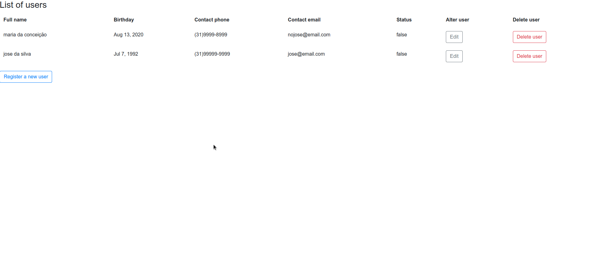

# gerencert-frontend

## Descrição
Desenvolver uma aplicação simples para controle de clientes seguindo os requisitos abaixo.

# Front-end

Desenvolva uma interface contendo um botão para cadastro de novo cliente, e uma listagem dos clientes cadastrados. O botão novo, deve direcionar o usuário para uma nova tela contendo um formulário com os seguintes campos:

| Field  |  Type |
| ------------------- | ------------------- |
|  fullName |  String |
|  cpf |  String |
|  birthday |  String |
|  contact.phone |  String |
|  contact.email |  String |
|  status |  boolean |

Na tela de listagem de clientes, o usuário deve conseguir clicar em algum cliente da lista, para poder editar, a mesma ação deve direcionar o usuário para uma tela com o mesmo formulário de cadastro, porém com as informações já preenchidas. A tela deve possibilitar que o usuário altere alguma informação e salve. A tela também deve conter um botão para remover o client

# Requisitos 

- Angular 1.6
- Git

### Principais tecnologias utilizadas:

- 1.Angular 1.6
- 2.Git
- 3.bootstrap

## Como rodar a aplicação 


No terminal, clone o projeto:

```git clone: https://github.com/felipe0520/gerencert-frontend/ ```

Entre na pasta do projeto  :
```gerencert-frontend```

Instale as dependências : 
```npm install ```

Execute a aplicação:
Utilize alguma extensão para simular um servidor. Foi usado o live server

## bugs

O sistema de alteração de páginas não está funcionando corretamente.
A aplicação usa o ``` $location.path ``` para tentar essas alterações após finalizar uma tarefa


Obs: Para rodar a aplicação é necessário um banco de dados e obter os dados necessários

## Gif da aplicação


